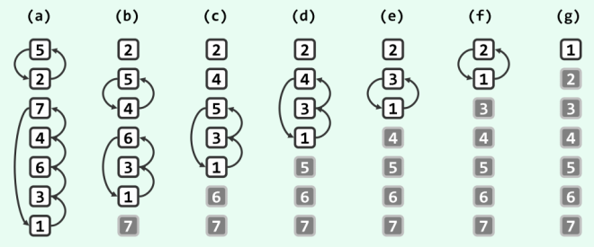

# 冒泡排序

原理：通过不断改善局部有序性实现数列的整体有序性。它重复地走访过要排序的数列，从前向后依次检查每一对相邻的元素，一旦发现逆序即交换二者的位置。对长度为n的序列，共需做n-1次比较和不超过n-1次交换，这一过程称作一趟扫描交换(如下图所示)。



## 代码

```java
public class BubbleSort {
    /**
     *普通版本
     * @param arr
     */
    public void bubbleSort1(int[] arr) {
        int temp = 0;
        for (int i = arr.length - 1; i > 0; --i) {
            for (int j = 0; j < i; ++j) {
                if (arr[j + 1] < arr[j]) {
                    temp = arr[j];
                    arr[j] = arr[j + 1];
                    arr[j + 1] = temp;
                }
            }
        }
    }

    /**
     * 优化版本1
     *
     * @param arr
     */
    public static void bubbleSort2(int[] arr) {
        for (int i = arr.length - 1; i > 0; i--) {
            boolean isSorted = true;
            for (int j = 0; j < i; ++j) {
                if (arr[j + 1] < arr[j]) {
                    int temp = arr[j];
                    arr[j] = arr[j + 1];
                    arr[j + 1] = temp;
                    isSorted  = false;
                }
            }
            if (isSorted) break;
        }
    }

    /**
     * 优化版本2
     *
     * @param arr
     */
    public static void bubbleSort3(int[] arr) {
        int k = arr.length - 1;
        for (int i = k; i > 0; ) {
            for (int j = 0; j < i; ++j) {
                if (arr[j + 1] < arr[j]) {
                    int temp = arr[j];
                    arr[j] = arr[j + 1];
                    arr[j + 1] = temp;
                    k = j;
                } else k = 0;
            }
            i = k;
        }
    }
}

```
